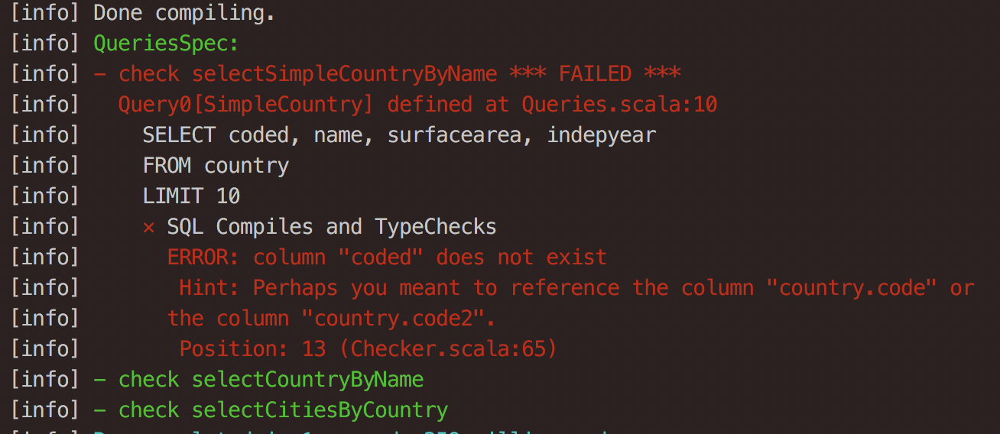
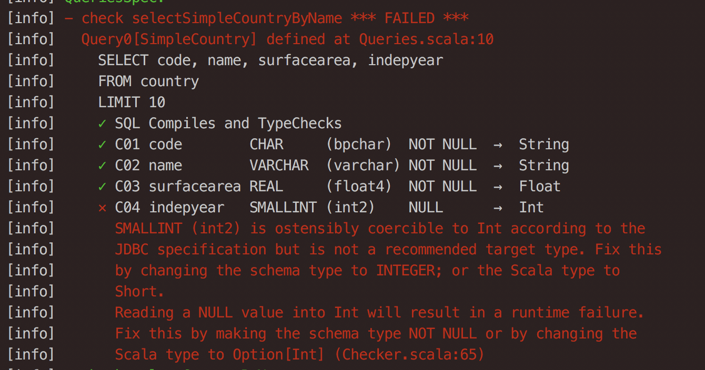
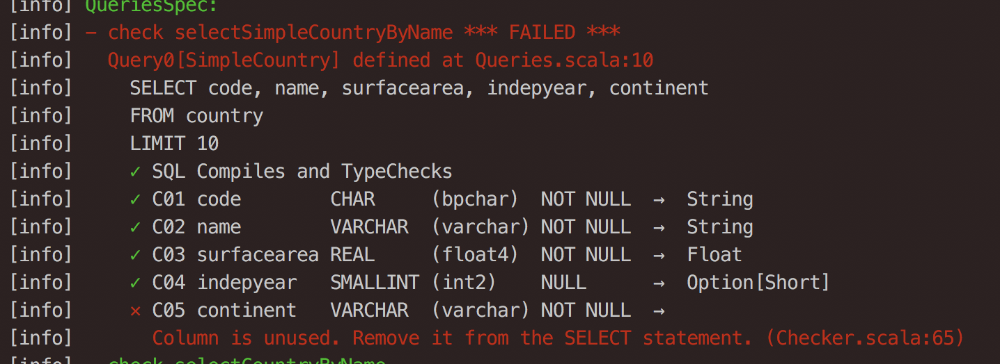

# Typechecking SQL queries with doobie

For one of our clients I recently worked on a Scala-based API that relied on a PostgreSQL integration for the majority of its data. It used the standard Java PostgreSQL JDBC connector to query the data in combination with a handful of custom functions to abstract away the boilerplate as much as possible. It did its job, but as the requirements and the codebase evolved we began to run into some limitations:

- The custom function we used to create a `PreparedStatement` used pattern matching on the function arguments to determine the correct mapping from the Scala type to the SQL data type. This works fine for the primitive types, but not so much for more complex container types like `Option[T]`. Upon pattern matching these container types you will come across Scala's type erasure. In the specific case where you match a `Option[T]` you can therefore determine whether or not you have an actual value or a `None`, but have no way to determine the type of `T` and hence no way to determine to which SQL data type to map to.
- There was no way to determine whether the mapping from SQL data type to the Scala type was correct. E.g. a `VARCHAR NULL` column could be mapped without problems to a `String` in Scala up to the moment where you would want to use that value anywhere in your Scala code. If PostgreSQL would return a `NULL` here, an ugly `NullPointerException` is awaiting you at runtime.
- All calls to PostgreSQL were done in a blocking fashion, however it would be good practice to asynchronously query the database (or at least use a separate threadpool for blocking I/O), so that the API can continue serving incoming requests.

## Experimenting with doobie

To overcome these issues I wanted to try out a library that I recently came across called doobie. doobie is a [Typelevel.scala](http://www.typelevel.org) project that provides a principled approach towards using JDBC. Why doobie?

- Our client's codebase already used (quite complex) SQL statements and I felt they expressed their intentions well, probably better than to try and awkwardly mold them in a dsl as provided by e.g. Slick. doobie embraces the SQL language so it seemed a good fit in combination with what we already had available.
- It has built-in support for unit testing and typechecking your SQL queries. You get extensive feedback about which improvements should be made.
- It is easy to directly map your SQL results to Scala case classes. It improves readability and limits the amount of boilerplate.
- It is easy to let Doobie work together with Monix, another one of my favorite Typelevel.scala libraries, for controlled asynchronous code execution.


## Getting started

In this example I'm using a dataset that doobie also uses for it's examples, a set of tables (countriers, cities amongst others) that together describe 'the world'. Let's look at some sample data from the `countries` table:

| code | name                 | continent     | region                     | surfacearea | indepyear | ... |
|------|----------------------|---------------|----------------------------|-------------|-----------|-----|
| AFG  | Afghanistan          | Asia          | Southern and Central Asian | 652090.0    | 1919      |     |
| NLD  | Netherlands          | Europe        | Western Europe             | 41526.0     | 1581      |     |
| ANT  | Netherlands Antilles | North America | Caribbean                  | 800.0       | <null>    |     |

Based on a subset of properties that we have available in the table, let's define a `Country` as follows:

```scala
case class Country(
  code: String,
  name: String,
  surfaceArea: Float,
  independenceYear: Int
)
```
Using the API that doobie provides, we can construct a query instruction:

```scala
val query = sql"""SELECT code, name, surfacearea, indepyear
                  FROM countries
                  LIMIT 10""".query[Country]
```

`query` does not contain any answers from the database, it's a description of a program that needs to be run to obtain these answers. For this we can use a `Transactor`. A `Transactor` knows how to connect to the database and knows how to turn the `query` program into an asynchronous effect, a feature we were looking for!

At my client we used [HikariCP](https://github.com/brettwooldridge/HikariCP) to maintain the connection pool to PostgreSQL, doobie allows you to keep using Hikari by providing a `HikariTransactor`:

```scala
 val transactor: Task[HikariTransactor[Task]] =
    HikariTransactor.newHikariTransactor[Task](
      driverClassName = "org.postgresql.Driver",
      url = "jdbc:postgresql://localhost/world",
      user = "demo",
      pass = ""
    ).memoize
```

So what's happening here? Here we create a `HikariTransactor` by providing it the connection details to the PostgreSQL database and tell it that incoming doobie programs should be transformed to a (Monix) `Task`, i.e. an asynchronous operation that (when run) executes the database query. A Monix `Task` is like a Scala `Future` but is lazily evaluated and has plenty more ways to be executed (e.g. in a scheduled manner). See the [thorough documentation](https://monix.io/docs/2x/) to read more about Monix.

Since the construction of the HikariTransactor requires state and is therefore an effect, we actually get back a `Task` that provides us the `HikariTransactor`. Since by default `Task`s are (re-)evaluated with every run, we explicitly tell it to `memoize` the result on the first run, so that we create exactly one Hikari connection pool, no matter how often we run the `Task`.

Now that we have a `Transactor` we can execute our `query` as follows:

```scala
def select[T](query: ConnectionIO[T]): Task[T] =
  for {
    xa <- transactor
    result <- query.transact(xa)
  } yield result

val asyncResult: Task[List[Country]] = select(query.list)
```

Instead of `query.list`, which will give us a `List[Country]`, we could also have chosen to call `query.option` for an `Option[Country]` or `query.unique` for a `Country` (or an exception in case the query did not exactly return one row).

## Query Typechecking

In the `query` we defined above we map some fields from a SQL query to a case class, but how do we know that this actually works as expected? doobie doesn't provide compile time typechecking unfortunately, but it makes typechecking your queries during unit testing really easy:

```scala
class QueriesSpec extends WordSpec with Matchers with IOChecker {
  ...
  "check query" in {
    check(query)
  }
}
```
When something is wrong with your query, doobie provides extensive feedback on what is going wrong. E.g. the query doesn't compile:



or, the types don't add up:



or you are selecting more fields than you are using:



The ease of unit testing your queries definitely makes this a great feature of doobie.

## Parameterized Queries

It is pretty easy to add parameters to your queries. Say for example that we want to extend our initial query as defined above by providing a configurable limit and also only want to query countries that became independent after some specified year:

```scala
def selectCountries(independentAfter: Short, limit: Long) = sql"""
  SELECT code, name, surfacearea, indepyear
  FROM countries
  WHERE indepyear > $independentAfter
  LIMIT $limit
""".query[Country]
```

This actually gets transformed into a `PreparedStatement` where the input parameters are sent separately from the query itself. At the same time this greatly improves readability of your query.

There is one catch here. Every now and then you want to dynamically construct you queries. In this case your parameters should be part of the query and not part of the input data. To overcome this problem doobie provides a more finegrained way to construct your query, using `Fragments`. Say e.g. (as an artifical example) that you have two tables with country data. Depending on some context you either want to read from one or the other:

```scala
def selectCountriesFrom(table: String, limit: Long) = (const("""
  SELECT code, name, surfacearea, indepyear
  FROM $table""") ++ fr"""
  LIMIT $limit
""").query[Country]
```
The approach doobie chooses is clear, but personally this `const()` function gives me too much distraction from the interesting part. At our client's project we preferred to use an implicit conversion to easily concatenate normal strings with `Fragments`:

```scala
implicit def stringToConst(str: String) = const(str)

def selectCountriesFrom(table: String, limit: Long) = (
  """SELECT code, name, surfacearea, indepyear
     FROM $table""" ++ fr"""
     LIMIT $limit"""
).query[Country]
```

Of course this should be used with care, because you don't want to accidentily run into SQL injection problems here!

## Beware!

So far I have shown you the cool stuff how doobie can be helpful. The conciseness and ease of mapping that doobie provides comes with a downside of which you should be aware. Since doobie only checks that the types match and there is no explicit mapping from a named field in your case class to a column name in the table, it is important to order the fields that you query exactly like the order in your case class (or vice versa). For example, if I have:

```scala
case class Foo(a: String, b: String)
val query = sql"SELECT b, a FROM Foo").query[Foo]
```

The query compiles, the types add up, but the result won't be like what you probably intented. Some additional unit tests to check the contents of your results is therefore advisable!


## Conclusion

I have found the use of doobie very easy, resulting in concise and clear code. It is a welcome addition in my toolset as a data and software engineer.
By using doobie at our client's project we:

- reduced the lines of custom code to be maintained by ± 50%!
- fixed a lot of (potential) bugs due to mismatches in types between the database and our Scala case classes.
- made it easy to provide asynchronous, hopefully non-blocking I/O (this is still dependent on the implementation of the JDBC driver!)

The code examples in this blogpost are (loosely) taken from a complete example project that I created and made available [here](https://github.com/godatadriven/doobie-monix-jdbc-example). Feel free to clone it and browse around. There is also extensive documentation to be found about doobie in the [book of doobie](http://tpolecat.github.io/doobie/docs/01-Introduction.html)
